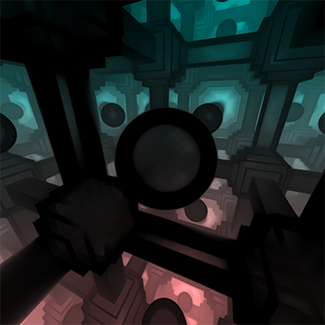
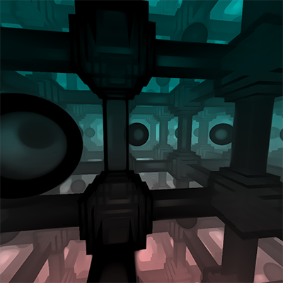

###


# Infinite Machine

Raymarching transparent effects with repetition and motion.




  

- WebGL2 boilterplate.
- [vertext shader] + [fragment shader] version 300 es.
- Ray Marching (Sphere Tracing) .
- Domain repetition and animation.
- Use mod(x,y) for timing / movment.

`WebGL2Base` creates the webgl2 canvas objects and links the fragment shader and vertex sahder programs to the application and video card. `machine.js` extends the base with specific uniforms for the shaders (variables passed in like time/resolution etc)

## Run the example

Requires Node v10.15.03 or greater

```bash
$ yarn install
$ yarn start
```

open http://localhost:2020
